# 🏘️ RT Management System

RT Management System adalah aplikasi berbasis web yang digunakan untuk membantu pengelolaan administrasi lingkungan RT, mulai dari data rumah, penghuni, tagihan, pembayaran, pengeluaran hingga laporan keuangan bulanan.

Project ini dikembangkan menggunakan **Laravel REST API** sebagai Backend dan **React.js** sebagai Frontend.

---

# ✨ Features

## Dashboard
- Statistik Rumah
- Statistik Rumah Terisi & Kosong
- Statistik Pemasukan Bulanan
- Statistik Pengeluaran Bulanan
- Saldo Bulanan
- Grafik Income vs Expense (1 Tahun)
- Recent Payment
- Recent Expense

## House Management
- CRUD Rumah
- Detail Rumah
- Assign Resident
- Checkout Resident
- Resident History
- Payment History

## Resident Management
- CRUD Penghuni
- Detail Penghuni

## Billing
- Generate Billing Bulanan
- Daftar Billing
- Status Paid / Unpaid

## Payment
- Pembayaran Single Bill
- Pembayaran Multiple Bill
- Payment History
- Payment Detail

## Expense
- CRUD Expense
- Expense Category

## Report
- Monthly Summary
- Income Report
- Expense Report
- Balance Report
- Detail Income
- Detail Expense

---

# 🛠️ Tech Stack

## Backend

- Laravel 12
- PHP 8.3+
- MySQL
- Eloquent ORM
- REST API

## Frontend

- React 19
- Vite
- React Hook Form
- Axios
- Tailwind CSS

---

# 📂 Repository

https://github.com/DonyAlUzzam/rt-management
---

# ⚙️ Installation

## 1. Clone Repository

```bash
git clone https://github.com/USERNAME/rt-management.git
```

Masuk ke folder project.

```bash
cd rt-management
```

---

# 🚀 Backend Installation

Masuk ke folder rt-management-api.

```bash
cd rt-management-api
```

Install dependency.

```bash
composer install
```

Copy file environment.

```bash
cp .env.example .env
```

Generate application key.

```bash
php artisan key:generate
```

Atur konfigurasi database pada file `.env`.

```env
DB_CONNECTION=mysql
DB_HOST=127.0.0.1
DB_PORT=3306
DB_DATABASE=rt_management
DB_USERNAME=root
DB_PASSWORD=
```

Jalankan migration dan seeder.

```bash
php artisan migrate:fresh --seed
```

Jalankan backend server.

```bash
php artisan serve
```

Backend akan berjalan pada

```
http://localhost:8000
```

---

# 💻 Frontend Installation

Buka terminal baru, kemudian masuk ke folder rt-management-frontend.

```bash
cd rt-management-frontend
```

Install dependency.

```bash
npm install
```

Copy file environment.

```bash
cp .env.example .env
```

Edit file `.env`.

```env
VITE_API_URL=http://localhost:8000/api
VITE_API_STORAGE=http://localhost:8000/storage
```

Jalankan frontend.

```bash
npm run dev
```

Frontend akan berjalan pada

```
http://localhost:5173
```

---

# 🌱 Demo Data

Untuk mempermudah proses pengujian, project ini telah dilengkapi dengan Seeder.

Jalankan perintah berikut pada folder backend.

Seeder akan otomatis membuat data berikut.

- 20 Houses
- 18 Residents
- Active Occupancy
- Bill Types
- Bills selama beberapa bulan
- Payments
- Payment Details
- Expense Categories
- Expenses

Sehingga seluruh fitur aplikasi dapat langsung diuji tanpa perlu melakukan input data secara manual.
---

# 📸 Screenshot

## Dashboard

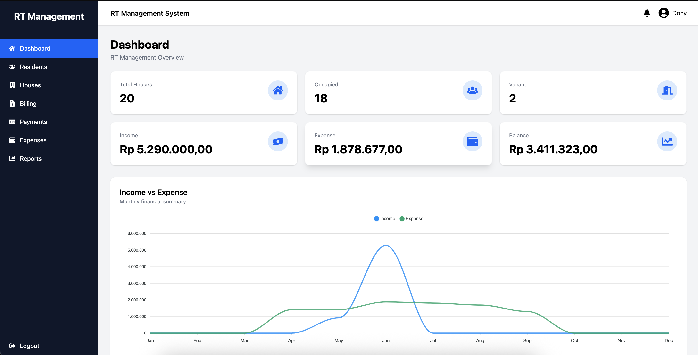

---

## Resident

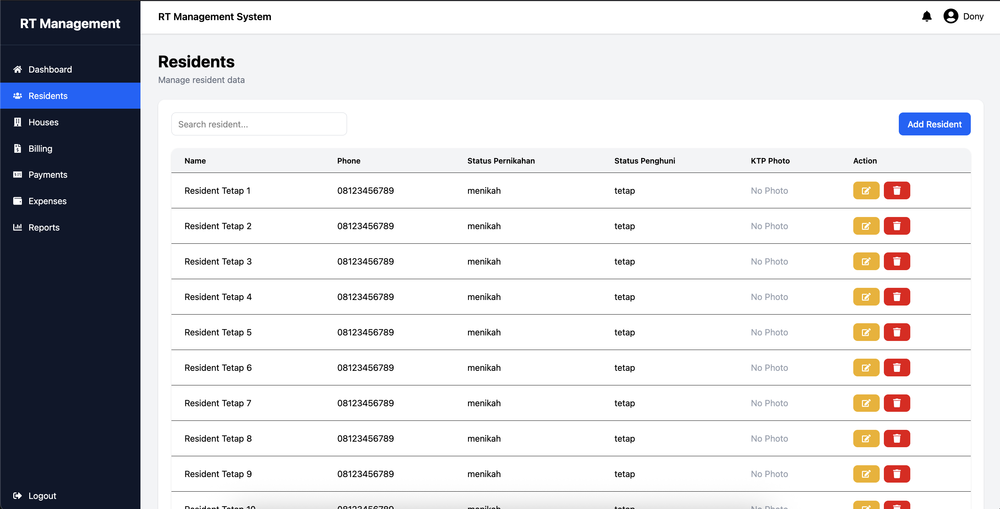

---

## House List

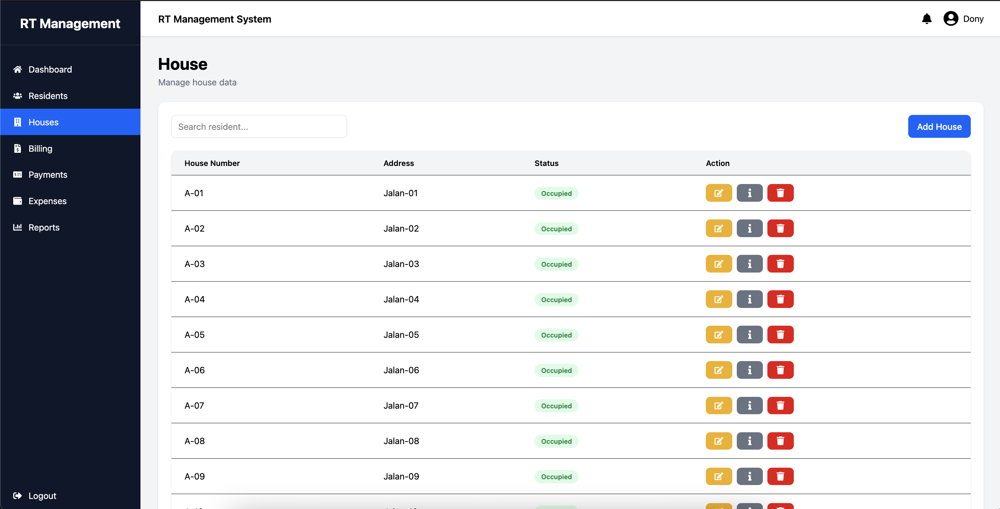

---

## House Detail

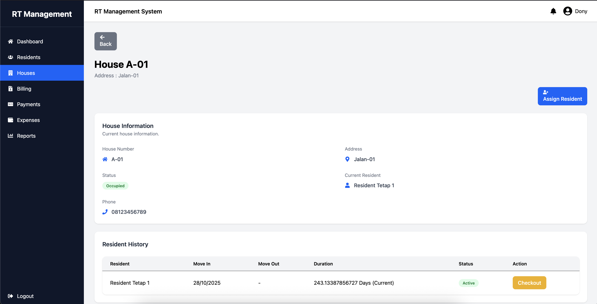

---

## Assign Resident

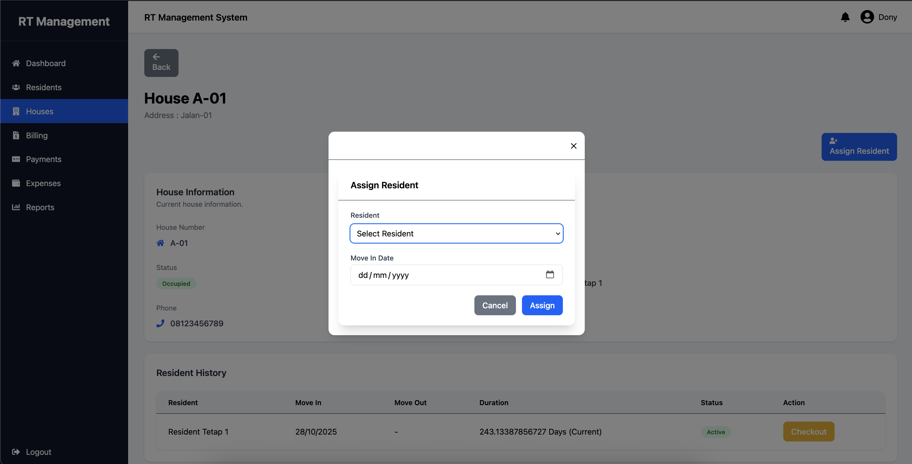

---

## Billing

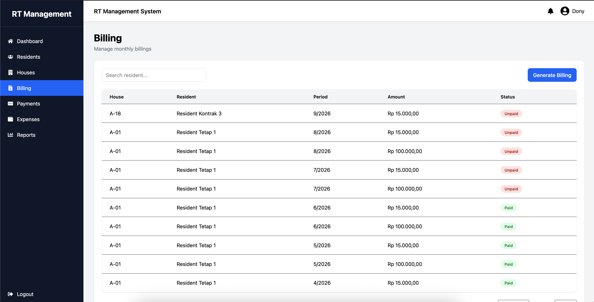

---

## Payment

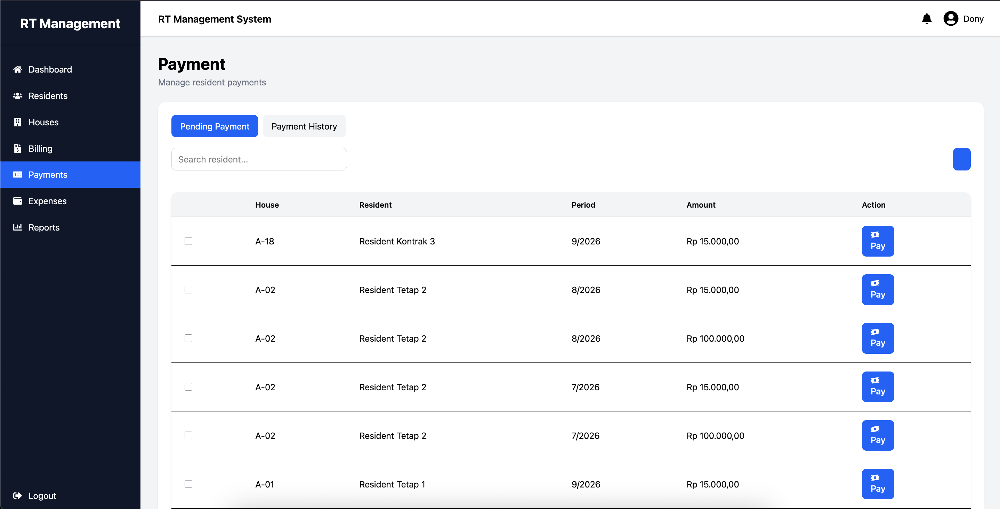

---

## Payment History

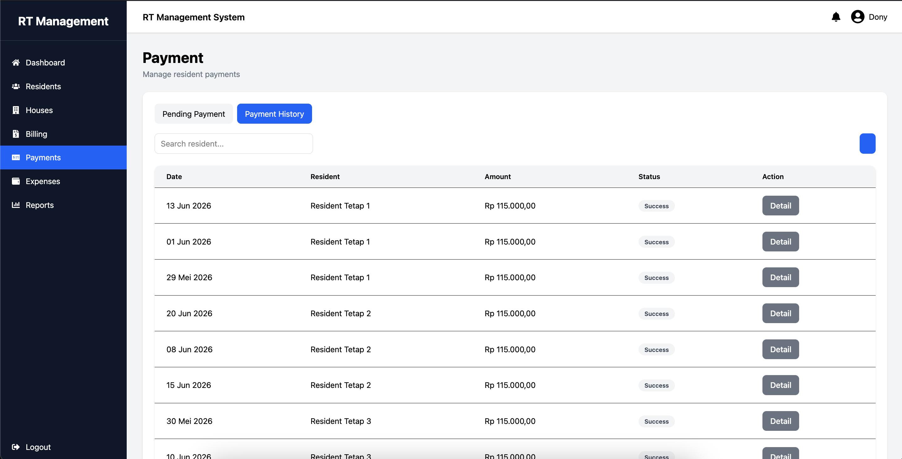

---

## Payment Detail

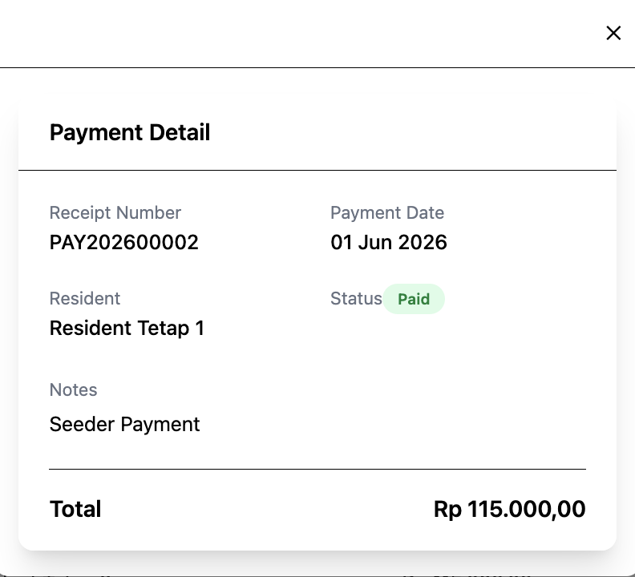

---

## Expense

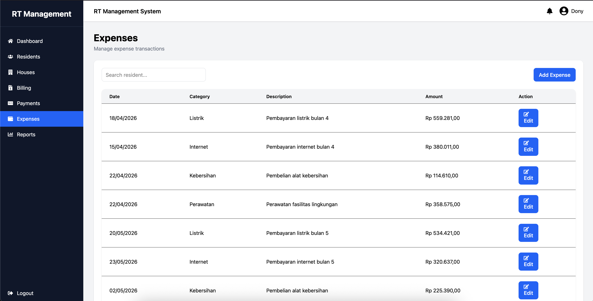

---

## Expense Category

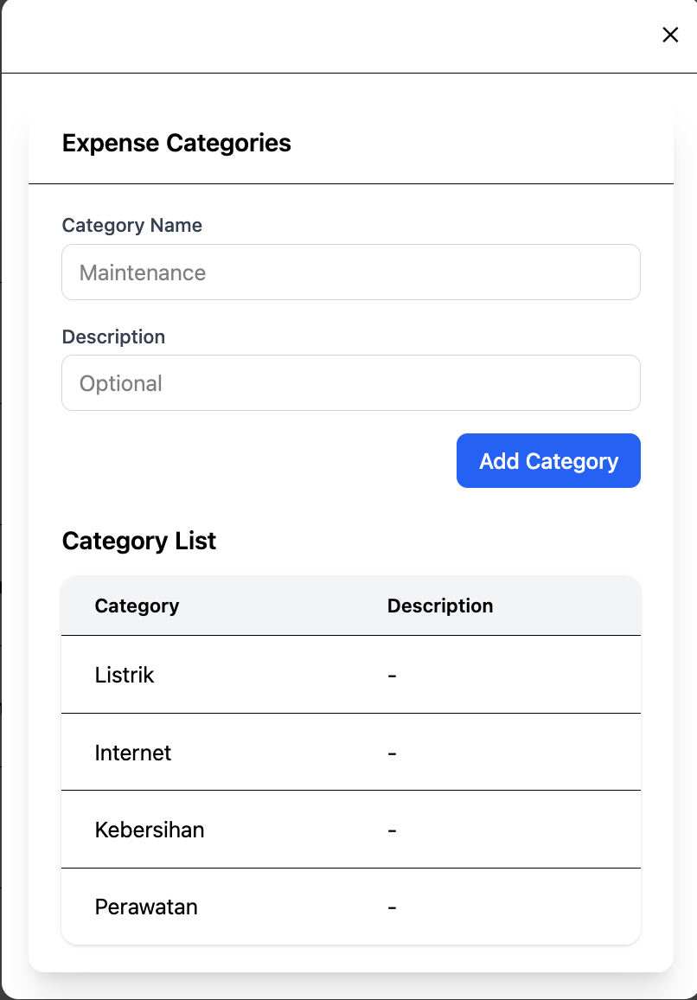

---

## Monthly Report

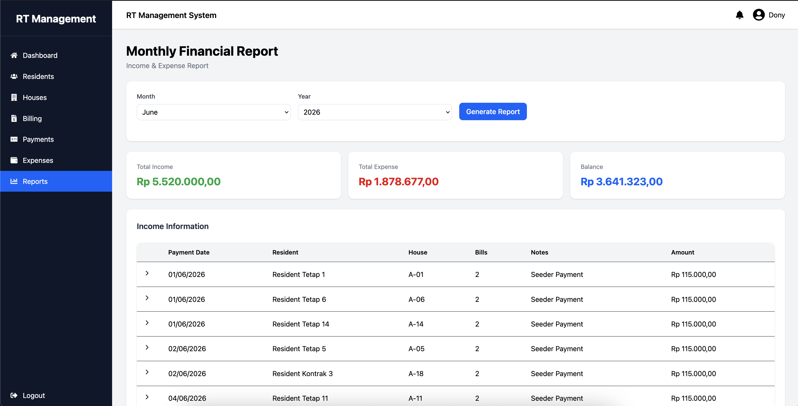

---

# 🗄️ Database ERD

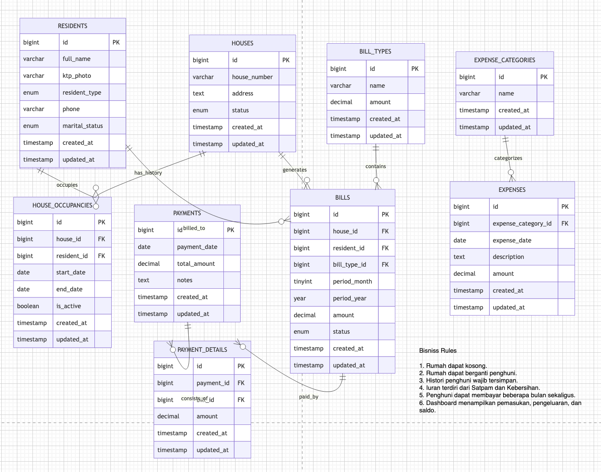

---

# 📌 Main Features

- House Management
- Resident Management
- Billing Management
- Multiple Payment
- Expense Management
- Dashboard Analytics
- Monthly Financial Report

---

# 👨‍💻 Author

**Dony Al-Uzzam**

Full Stack Web Developer

Laravel • React • MySQL • REST API